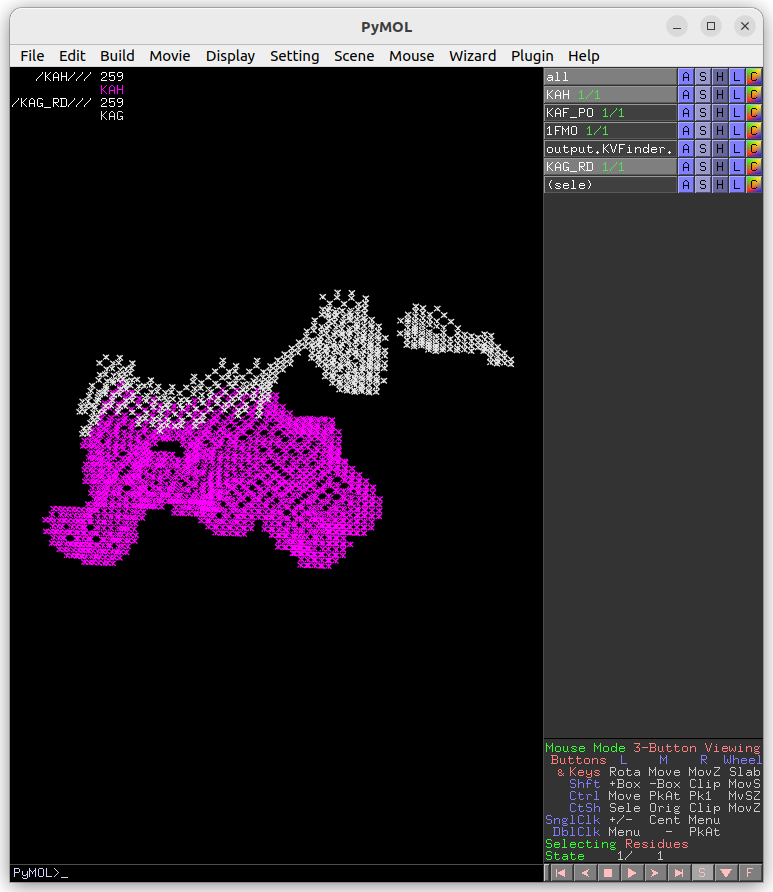

Overview
========

The PyMOL KVFinder-web Tools is a user-friendly graphical user interface that enables customization of parKVFinder parameters for a target structure and submits jobs via HTTP POST request to a configured KVFinder-web service. After submission, jobs are routinely requested via HTTP GET request to the KVFinder-web service by a worker thread. When a job is finished, the worker thread automatically processes the incoming data to files.

Installation
============

PyMOL KVFinder-web Tools is a PyMOL v2 plugin for detecting and characterizing biomolecular cavities at a KVFinder-web service.

`PyMOL v2 <https://pymol.org/2/>`_ is required if you wish to use PyMOL KVFinder-web Tools.

Afterwards, install the required Python packages from `requirements.txt <https://github.com/LBC-LNBio/PyMOL-KVFinder-web-Tools/blob/master/requirements.txt>`_ file on PyMOL's Python.

```bash
pip3 install -r requirements.txt
```

or directly,

```bash
pip3 install pyqt5 toml typing
```

Now, download the latest version of PyMOL KVFinder-web Tools from `here <https://github.com/LBC-LNBio/PyMOL-KVFinder-web-Tools/releases/latest/download/PyMOL-KVFinder-web-Tools.zip>`_.

1. Open PyMOL;
2. Go to **Plugin** menu and select **Plugin Manager** option;
3. The **Plugin Manager** window will open, go to the **Install New Plugin** tab;
4. Under **Install from local file** group, click on **Choose file...**;
5. The **Install Plugin** window will open, select the `PyMOL-KVFinder-web-Tools.zip`;
6. The **Select plugin directory** window will open, select `/home/user/.pymol/startup` and click **OK**;
7. The **Confirm** window will open, click on **OK**;
8. The **Sucess** window will open, confirming that the plugin has been installed;
9. Restart PyMOL;
10. **PyMOL KVFinder-web Tools** is ready to use under **Plugin** menu.

Or, if you clone this `repository <https://github.com/LBC-LNBio/PyMOL-KVFinder-web-Tools`_, instead of selecting `PyMOL-KVFinder-web-Tools.zip` (Step 5), user must select `__init__.py` of PyMOL-KVFinder-web-Tools directory.

Tutorial
========

On this tutorial, we are going to demonstrate how to use PyMOL KVFinder-web Tools with our publicly available KVFinder-web service.

All files used on this tutorial can be found under examples directory, on the PyMOL KVFinder-web Tools `repository <https://github.com/LBC-LNBio/PyMOL-KVFinder-web-Tools>`_.

Whole protein detection
-----------------------

First, load examples/1FMO.pdb into PyMOL. The **1FMO** is the catalytic subunit of a cAMP-dependent protein kinase (cAPK). 

After, open **PyMOL KVFinder-web Tools** under **Plugin** tab. The objects on the scene will be listed on the **Input PDB** box, on the **Main** tab. If not, click on the **Refresh** button.

The **Input PDB** selection sets which object will be analyzed by KVFinder-web service. Then, select 1FMO.


The default parameters are designed to make a simple and fast whole
protein detection. To submit a job with the default parameters to KVFinder-web service, just click on **Run KVFinder-web** button.

.. image:: img/main_tab_2.png
    :width: 800

After successfully submitting the job to KVFinder-web service, a window will appear with the Job ID. For instace, the Job ID of our submission is 18100368098668549413.


The job informations are stored on ~/.KVFinder-web directory in TOML-formatted files and can be visualized on **Results** tab under **Jobs** tab. The status of our submission (18100368098668549413) is displayed on the **Status** field.

.. image:: img/jobs_tab_1.png
    :width: 800

After completion, the **Status** field will change to **Completed** and the **Show** button will be enabled. Then, click on **Show** button load cavities into PyMOL viewer and the results on the **Visualization** tab. In addition, the focus will be automatically shifted to the **Visualization** tab.


We can select cavities in the **Volume** or **Surface Area** lists to highlight them on a new object called **cavities**, identifying each cavity. Additionally, we can select cavity tags in the **Interface Residues** list to highlight residues around the cavities on a new object named **residues**.

.. image:: img/results_tab_2.png
    :width: 800

.. note::
    
    The interface residues surrounding the cavity KAF are colored in green (sticks), the surface points are colored in red (nb_spheres) and the remaining cavity points are colored in blue (non_bounded).

Changing cavity boundary
^^^^^^^^^^^^^^^^^^^^^^^^

KVFinder-web service is all about parameters customization of parKVFinder software. One of parKVFinder's most powerful assets is the ability to manually set the cavity boundary. 

parKVFinder works with a double probe system to detect cavities. A smaller probe, called Probe In, and a bigger one, called Probe Out, that defined two molecular surfaces with different accessibility. The space left between these surfaces is considered cavities.

Let's show the effect of varying **Probe Out** and **Removal Distance** on the cavity boundary.

First, we should copy the cavity KAF to a new object to compare cavity boundary from the previous execution.

.. code-block:: bash

    # Copy KAF
    select resn KAF and output.KVFinder.output
    create KAF, sele
    delete sele
    # Color KAF
    color magenta, KAF

Adjusting Probe Out
*******************

As mentioned above, adjusting the Probe Out size changes the level of the cavity boundary. So let’s go back on the **Main** tab and change the **Probe Out** size to 8.0 Å. Submit the job to KVFinder-web service again.

After completion, load the job results by clicking on **Show** button on **Results** tab under **Jobs** tab.

.. image:: img/pymol_viewer_1.png
    :width: 800

Again, copy the cavity KAF to a new object (KAF_PO).

.. code-block:: bash

    # Copy KAF
    select resn KAF and output.KVFinder.output
    create KAF_PO, sele
    delete sele

.. image:: img/pymol_viewer_2.png
    :width: 800

The cavity KAF detected with the 4 Å Probe Out (magenta) has a lower boundary than that detected with the 8 Å probe (white). Therefore, by increasing the size of the Probe Out, the cavity boundary is also raised.

Adjusting Removal Distance
**************************

Besides adjusting the Probe Out size, we can also adjust the Removal Distance to change the cavity boundary. So let's go back to the **Main** tab and change the **Removal Distance** to 1.2 Å and the size of Probe Out back to 4.0 Å. Submit the job to KVFinder-web service again.

After completion, load the job results by clicking on **Show** button on **Results** tab under **Jobs** tab.


Again, copy the cavity KAH (same region of the previous detections) to a new object (KAF_RD).

.. code-block:: bash

    # Copy KAH
    select resn KAH and output.KVFinder.output
    create KAH_RD, sele
    delete sele



  
The cavity KAF detected with the 2.4 Å Removal Distance (magenta) has a lower boundary than that detected with the 1.2 Å (KAH; white). Therefore, by decreasing the Removal Distance, the cavity boundary is also raised.

Furthermore, changing the cavity boundary by varying Probe Out and Removal Distance also affects cavity segregation.

.. note::

    Usually the Removal Distance adjustment is less time consuming than the Probe Out adjustment for similar effects.

Steered detection
-----------------

An important feature of parKVFinder is the steered detection of cavities. We continue our tutorial illustrating two distinct methods of cavity segmentation.

First, load examples/ligs_1FMO.pdb into PyMOL viewer. The **ligs_1FMO** is an adenosine (ADN) and a peptide kinase inhibitor (PKI).

Box adjustment mode 
^^^^^^^^^^^^^^^^^^^

Box adjustment mode explores closed regions with a custom box, which can be drawn via the GUI.

On the **Search Space** tab, select **Box Adjustment** check box. This will enable a **Box Adjustment** frame, which handles the custom box in PyMOL viewer

Then, select the adenosine ligand on ligs_1FMO object. This can be made on the PyMOL viewer by clicking on the ligand structure or using ``select resn ADN`` PyMOL command.

Click on **Draw Box** Button. This will create a custom box that limits the search space. It is fully customizable, but we will not change it for now.

.. image:: img/pymol_viewer_5.png
    :width: 800

On the **Main** tab, change **Removal Distance** back to 2.4 Å and submit the job to KVFinder-web service.

After completion, load the job results by clicking on **Show** button on **Results** tab under **Jobs** tab.

.. image:: img/pymol_viewer_6.png
    :width: 800

Now, let's customize the box parameters to segment the binding site of our target protein.

Each axis is associated with one color (red with X, green with Y and blue with Z). The adjustment is made by the arrows or directly setting the value in the entry on the **Search Space** tab in the **Box Adjustment** group. We can also adjust the box angles by the same procedure. After altering the values, just click on **Redraw ** button to redraw the box object using the new values.

Then, on the **Search Space** tab, reduce **Maximum X** to 1.0 Å and click **Redraw Box**. Submit the job to KVFinder-web service.

After completion, load the job results by clicking on **Show** button on **Results** tab under **Jobs** tab.

.. image:: img/pymol_viewer_7.png
    :width: 800

Lastly, click on **Delete Box** button to delete the custom box.

Ligand adjustment mode
^^^^^^^^^^^^^^^^^^^^^^

A last feature is to limit the search around a structure. In this last example, let's do a whole protein prospection again, but limiting the search space around ligands.

First, on the **Search Space** tab, deselect **Box Adjustment** check box, which will disable the previous enabled **Box Adjustment** frame.

Still on the **Search Space** tab, click on the check button **Ligand Adjustment**, which will enable the **Refresh** button, the **Ligand PDB** combo box and the **Ligand Cutoff** entry.

Afterwards, copy the adenosine (ADN) from ligs_1FMO to a new object.

.. code-block:: bash

    # Copy adenosine
    select resn ADN
    create adenosine, sele
    delete sele

Click the **Refresh** button to display all objects in the scene in the Ligand PDB combo box. Select the **ADN** on the combo box and reduce Ligand Cutoff to 3.0 Å. Submit the job to KVFinder-web service.

After completion, load the job results by clicking on **Show** button on **Results** tab under **Jobs** tab.


Now, let's shift focus to the two ligands (ADN and PKI) in the ligs_1FMO object.

On the **Search Space** tab, select the **ligs_1FMO** on the **Ligand PDB** combo box and increase **Ligand Cutoff** back to 5.0 Å. Back on the **Main** tab, increase **Probe Out** to 10.0 Å and reduce **Removal Distance** to 0.0 Å. Submit the job to KVFinder-web service.

After completion, load the job results by clicking on **Show** button on **Results** tab under **Jobs** tab.

.. image:: img/pymol_viewer_9.png
    :width: 800

Submitting an already sent job
------------------------------

Users may submit a job that have already been submitted to the KVFinder-web service and the job is still available on the web service.

In this scenario, when you submit the job, the **Job Submission** window will display the job status. If the job is completed, the GUI automatically loads the job into the GUI and PyMOL viewer.

For instance, resubmit your last job.

.. image:: img/job_submission_2.png
    :width: 300


Retrieving a Job by its ID
--------------------------

Users may share their jobs with colleagues by the **Job ID** that they receive when submitting a job.

On the **Results** tab, under **Jobs** tab, click on the **Add ID** button. A new window (Job ID Form) will appear.


In this window, fill the fields and click on **Add** button.

If the job was not available on the KVFinder-web service or does not exist. A window will apper stating that the *Job ID (XXXXX) was not found in KVFinder-web server!*.

Otherwise, a window will apper stating that the *Job successfully added!* together with the job status. Additionally, this Job ID will appear on the **Available Jobs** combo box.
